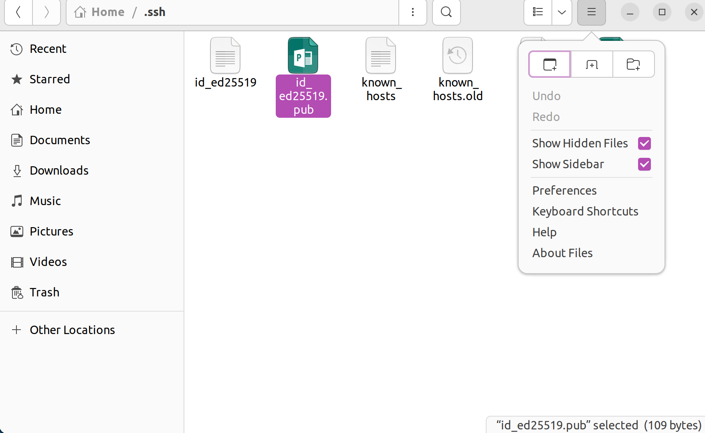

# FRP Git Workshop

In this workshop we'll go over some essential features for working with git. It will allow you to work alongside others on the same codebase in a structured and managable way. Some concepts we'll go over are:
- What is Git
- Creating a Repository
- Setting up ssh keys
- Clone, add, commit, push, pull
- Creating branches
- Merge, merge conflicts, rebase
- And more...

## Installing Git

In order to start using git on your machine, you need to first install it. For Linux systems:

```bash
sudo apt update
sudo apt install git
```

You can check whether the install was succesful:

```bash
git --version
```

And that's it! If you are planning on pushing BIG files, then you might also want to consider installing the git large file system:

```bash
sudo apt install git-lfs
```

## Using MarkDown for Documentation

Markdown (.md) files are a very nice way to do README's and general documentation on your repositories. You can do the typical **bold** and *italic*, but also allows to do stuff like:

**Equations**:

$$p(x;\mu,\Sigma)=\frac{1}{(2\pi)^{\frac{n}{2}}|\Sigma|^{\frac{1}{2}}}\exp\left(-\frac{1}{2}(x-\mu)^T\Sigma^{-1}(x-\mu)\right)$$

**Code**:

```python
def __name__ == "__main__":

    print("Hello World!")
```

**Images**:


**Hyperlinks:**

1. [Useful Resource Number 1](https://rogerdudler.github.io/git-guide/)
2. [Useful Resource Number 2](https://www.markdownguide.org/cheat-sheet/)
3. [Useful Resource Number 3](https://www.youtube.com/watch?v=dQw4w9WgXcQ)

**And much more...**

## Setting up ssh keys

These are stored on the root directory on a hidden **.ssh** folder. This directory is created when you generate your first key:

```bash
ssh-keygen -t ed25519 -C "your_email@example.com"
```

Then add the key to the SSH Agent:

```bash
eval "$(ssh-agent -s)"
ssh-add ~/.ssh/id_ed25519
```

Lastly copy the public key to your github access keys. You need to copy the contents of the **id_ed25519.pub** file located on the ~/.ssh hidden directory. You can do this with the text editor

```bash
nano ~/.ssh/id_ed25519.pub
```

Or through the file explorer by activating the option **Show Hidden Files**.



Then, on Github go to Settings >> SSH and GPG Keys >> New SSH key. You will need to paste the contents and give the key a name. That's it! Check if it worked by cloning this repository using ssh:

```bash
git clone git@github.com:IgnacioDassori/test_repository.git
```

This will allow you to push and pull without having to give any credentials.